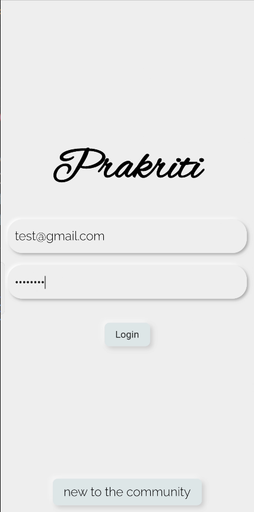
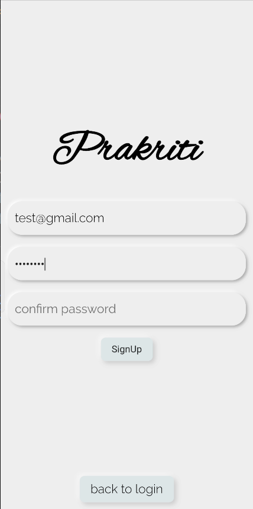
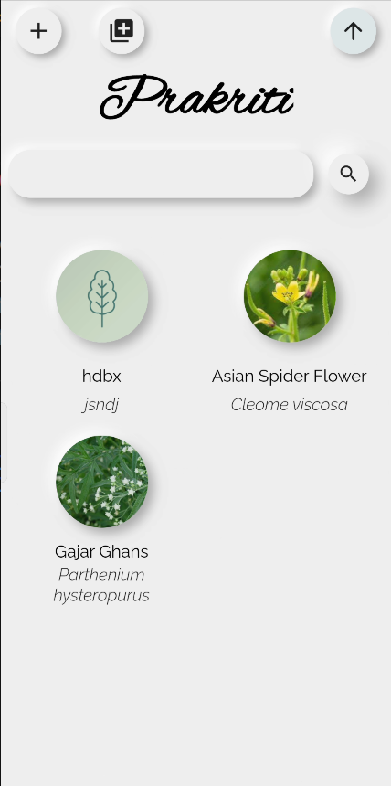
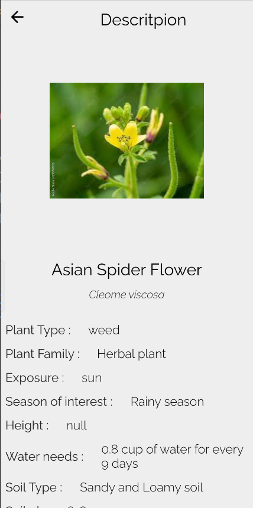
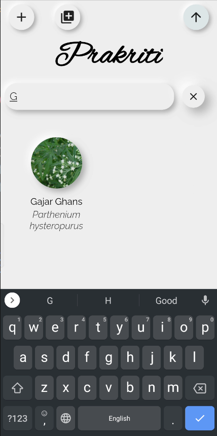

# prakriti_app

A new Flutter project.

## Getting Started
Please refer to the [Flutter docs](https://docs.flutter.dev/get-started/install) for setting flutter

after you have installed the sdk using the docs run
```
Flutter doctor
```
and install all other required software which are asked.

Now to run the app you can either use your own device [USB debugging](https://www.youtube.com/watch?v=W7nkxS9LMXs&ab_channel=OnlineTechTips)
or 
#### If you only want the apk
In the project directory
```
cd APK/
```
It's named app-debug.apk

### To get the project to your your local machine

```
git clone https://github.com/Vaibhav-Ramola/prakriti-app
```
```
cd prakriti-app
```

Before running the app make sure your IDE detects your emulator/device
To run the project, in the project directory run

```
Flutter run
```

### Screen Shots





